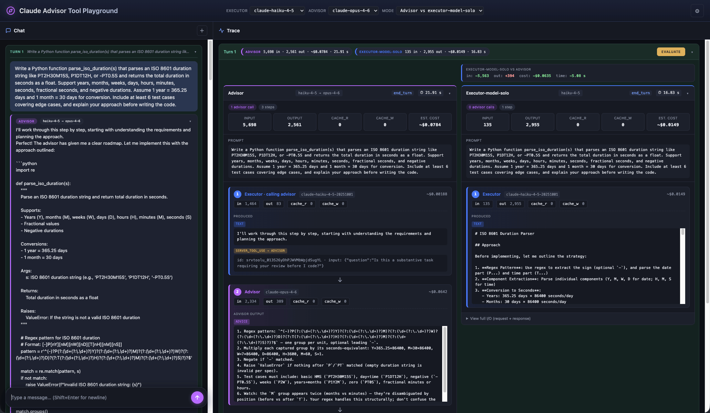
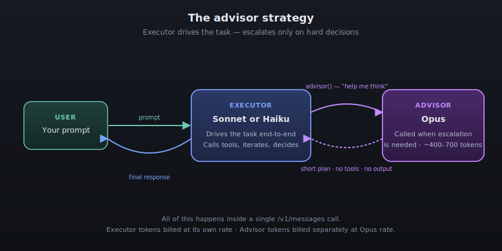
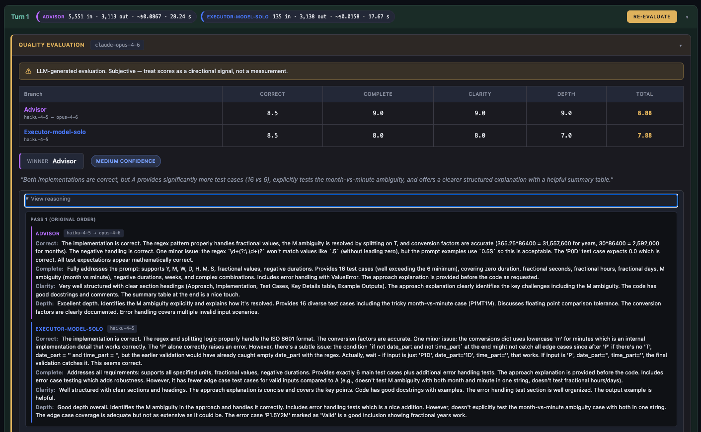

# Claude Advisor Tool Playground


[](https://www.ibuildwith.ai)
[](https://github.com/bymarcelolewin/claude-advisor-tool-playground)



**[Try it live](https://advisor-tool-playground.up.railway.app/)** — no install needed, just bring your own Anthropic API key.

A local web app for experimenting with Anthropic's [advisor tool](https://platform.claude.com/docs/en/agents-and-tools/tool-use/advisor-tool) (beta `advisor-tool-2026-03-01`). Send prompts through a fast executor model paired with a stronger advisor model, watch exactly what happened under the hood, compare against baselines running the same prompt, and ask a second LLM to score which response is actually better.

## What it's for

The advisor tool is a beta feature that lets a cheaper executor model call a smarter advisor model mid-inference for strategic guidance. That's interesting in theory, but two things are hard to see from code alone:

1. **Did the advisor actually fire?** And if so, what did it say?
2. **Is the extra cost worth it** compared to running a single model on the same prompt?

This playground hopes to answer both. Every turn is broken down into its individual API steps (executor → advisor call → executor continues) with full token counts and costs. Compare mode runs the same prompt through up to three paths in parallel so you can see cost, latency, and quality deltas side by side.

---

## The advisor strategy in 60 seconds

> *"Frontier-level reasoning applies only when the executor needs it."*
> — [The Advisor Strategy](https://claude.com/blog/the-advisor-strategy)

Running a frontier model like Opus end-to-end is expensive. Running Sonnet or Haiku end-to-end is cheap but less capable on hard problems. The advisor strategy pairs a cheap **executor** with a smart **advisor** so that frontier-level reasoning kicks in only at the moments it actually matters.



**Executor (Sonnet or Haiku)** drives the task end-to-end. It calls tools, reads results, iterates toward a solution, and produces all user-facing output. It pays the executor's rate for 95% of the tokens.

**Advisor (Opus)** is invoked *by the executor* only when the executor decides a decision is hard. It doesn't call tools. It doesn't produce output. It reads the executor's transcript and returns a short plan — typically 400–700 tokens — then disappears. Those tokens are billed at Opus rates, separately.

This inverts the traditional sub-agent pattern. Instead of a large orchestrator decomposing work and handing pieces to workers, a small executor drives execution and escalates only on hard decisions. It's simpler and has no cross-agent context overhead because the entire flow happens inside one `/v1/messages` call.

**What the numbers look like** (from Anthropic's blog post):

- **Sonnet + Opus advisor** vs. Sonnet solo: +2.7 points on SWE-bench Multilingual, and **11.9% cheaper** per agentic task (because the advisor prevents wasted exploratory work).
- **Haiku + Opus advisor** vs. Haiku solo: BrowseComp score jumps from 19.7% → 41.2% — more than double — while still costing 85% less per task than Sonnet solo.

The catch: the executor decides when to escalate. If your prompt is too trivial, the executor will skip the advisor entirely and you won't see the benefit. That's why this playground surfaces `advisor calls` and `steps` prominently in every trace — so you can tell at a glance whether the advisor actually fired.

---

## Quick start

You only need an **Anthropic API key** with access to the advisor beta. Optionally, an OpenAI API key if you want to use GPT as the quality judge.

### Option 1: Use it live (no install)

Go to **[advisor-tool-playground.up.railway.app](https://advisor-tool-playground.up.railway.app/)** — the welcome slideshow will walk you through setup. Just paste your API key in Settings and start sending prompts.

### Option 2: Run it locally

Requires **Node.js 18+**.

```bash
git clone https://github.com/bymarcelolewin/claude-advisor-tool-playground.git
cd claude-advisor-tool-playground
npm install
npm start
```

Open http://localhost:3000 in your browser.

### Enter your API key

On first launch, the welcome slideshow walks you through the advisor tool and how the playground works. When you're ready, click **"Open Settings & add API key"** (or click `⚙` in the header at any time). Paste your Anthropic API key and close the modal.

Your key is stored in your browser's `localStorage` and never leaves your machine — the server is fully stateless and never persists keys, conversations, or any user data.

You're now ready to send prompts.

---

## Tech stack

- **Backend:** Node.js + Express
- **Frontend:** Vanilla JS (no frameworks)
- **API:** [Anthropic SDK](https://github.com/anthropics/anthropic-sdk-node) (`@anthropic-ai/sdk`)
- **Hosting:** [Railway](https://railway.com)
- **Evaluation:** Anthropic Claude Opus 4.6 or OpenAI GPT-5.4 (LLM-as-judge, via direct API calls — no additional SDKs)

---

## Using it

### Send a prompt

Type into the floating input at the bottom of the chat pane and press Enter (or click the send button). You'll see:

- **Left pane:** your message, then one or more assistant replies appearing as bubbles with a live elapsed-time counter while the call is in flight
- **Right pane:** a detailed trace of every API step the call produced — model used, tokens, cost, and the raw content each step generated

Each conversation turn is wrapped in a collapsible container on both sides so you can focus on whichever turn you're studying.

### Pick your models

Three dropdowns sit at the top of the window:

- **Executor model** — `claude-haiku-4-5`, `claude-sonnet-4-6`, or `claude-opus-4-6`. This is the model doing the main work.
- **Advisor model** — `claude-opus-4-6` (the only valid advisor per the beta spec).
- **Mode** — single-branch or one of three compare modes (see below).

The canonical pair is Sonnet executor + Opus advisor. That's the whole point of the feature: let the cheap model do most of the work and only call the expensive one when it needs strategic input.

### Compare mode

The **Mode** dropdown lets you run the same prompt through multiple execution paths in parallel:

| Mode | What runs | Cost |
|---|---|---|
| **Advisor only** | Just the executor + advisor tool path (default) | 1× |
| **Advisor vs executor-model-solo** | Advisor path + same executor model without the advisor tool | 2× |
| **Advisor vs advisor-model-solo** | Advisor path + advisor model used alone with no tools | 2× |
| **All three** | All of the above | 3× |

When multiple branches are active, the trace pane shows them side by side with **delta pills** that compare each baseline to the advisor branch on four metrics: input tokens, output tokens, estimated cost, and wall-clock time.

- 🟢 **Green** = baseline beat the advisor (cheaper, faster, or fewer tokens)
- 🔴 **Red** = baseline lost (more expensive or slower)
- ⚪ **Gray** = tied

Each branch maintains its own independent conversation history, so follow-up turns diverge naturally — after turn 1, each branch is replying to its own previous output, not to a shared one.

**Conversation totals dashboard.** Pinned at the top of the Trace pane, a cumulative scoreboard shows per-branch totals — input, output, cost, and time — across every turn in the conversation, plus a shared turn count. In compare modes, a small green `←` marks the lowest value in each tile so you can see which branch is ahead on efficiency at a glance. The delta pills answer *"how did this turn compare?"*; the dashboard answers *"which branch is winning over the whole conversation?"*

**Mode is locked once a conversation starts.** The moment you send the first message, the Mode dropdown is disabled until you start a new conversation via the `＋` button. This is intentional — switching modes mid-conversation would give different branches different turn counts and (worse) cold-start histories, making the comparison meaningless.

**Reset** (the `+` icon above the chat pane) clears all branches, the trace, and any evaluation results. It asks for confirmation first.

---

## Quality evaluation



Cost and latency comparisons are easy. The harder question is *"which branch actually produced a better answer?"* For open-ended prompts there's no objective ground truth, so this tool uses an **LLM-as-judge** approach: a strong model reads the outputs for a single turn and scores them on a fixed rubric.

### How to run one

When compare mode is active and at least two branches succeeded, every trace turn shows an **Evaluate** button in its header. Click it and the judge runs in the background. A few seconds later, a panel appears inside that turn group showing scores, a winner, and per-dimension reasoning.

Evaluations are **opt-in per turn**. Nothing runs automatically — if you don't click Evaluate, no extra API calls happen and nothing extra gets billed.

### The rubric

Every evaluation scores each branch 1–10 on four dimensions:

| Dimension | What the judge is looking for |
|---|---|
| **Correctness** | Is the content factually and technically accurate? Any errors or hallucinations? |
| **Completeness** | Does it fully address what was asked? Are parts missed or hand-waved? |
| **Clarity** | Is the response well-structured and easy to follow? |
| **Depth** | Does it go beyond surface-level with useful specifics and trade-off reasoning? |

Plus an overall **winner** (or "tie"), a **confidence** level (low / medium / high), and a one-sentence summary.

### Why you can trust it (a little)

LLM-as-judge has well-documented failure modes. We push back on several:

- **Position bias** — judges often prefer whatever response they see first. Every evaluation runs the judge **twice in parallel** with the candidates in swapped orderings, then averages the scores. If the two runs disagree on the winner, the result is flagged as `low confidence`.
- **Blinding** — candidates are labeled `Response A` / `Response B` / `Response C` in the judge prompt. The judge never sees branch names or model names.
- **Length bias** — the judge is explicitly instructed not to favor longer responses.
- **Reason-then-score** — the judge must write per-dimension reasoning *before* committing to numeric scores, which reduces snap judgments.

Still, treat the scores as a **directional signal, not a measurement.** Every eval panel carries a visible warning saying exactly that.

### One important caveat for turn 2+

On turn 1 every branch answers the same prompt from scratch — that's a clean comparison. But on turn 2+, each branch's follow-up is being applied to *its own* turn-1 response. A word like *"it"* in your follow-up resolves to different things on different branches, so you're comparing **trajectories**, not models on the same input. The eval panel adds a second warning line when this applies.

### Choosing a judge

In the Settings modal under **Quality Evaluation**, pick one of:

- **Anthropic** (uses `claude-opus-4-6`) — uses your existing Anthropic API key
- **OpenAI** (uses `gpt-5.4`) — requires a separate OpenAI API key you paste in the same section

You can also edit the judge prompt / rubric directly in the same section. The default is strong; only change it if you know what you're doing.

### Cost

Each evaluation fires **2 judge calls** (the swapped orderings). Rough per-evaluation cost for a typical turn:

- **claude-opus-4-6:** ~$0.05–$0.15 per eval
- **gpt-5.4:** ~$0.02–$0.06 per eval

Exact numbers appear in the eval panel footer after each run.

---

## Test prompts

Two prompts designed to trigger the advisor (substantive work where planning helps), and two that shouldn't (single-step factual answers):

**Should trigger the advisor:**

1. > Write a Python function `parse_iso_duration(s)` that parses an ISO 8601 duration string like `PT2H30M15S`, `P1DT12H`, or `-PT0.5S` and returns the total duration in seconds as a float. Support years, months, weeks, days, hours, minutes, seconds, fractional seconds, and negative durations. Assume 1 year = 365.25 days and 1 month = 30 days for conversion. Include at least 6 test cases covering edge cases, and explain your approach before writing the code.

2. > Design a URL shortener service with custom aliases, per-link expiration, and click analytics. Describe: (a) the database schema with indexes, (b) the HTTP API endpoints with request/response shapes, (c) the short-code generation strategy and how you'd handle collisions, (d) how analytics events are written without slowing down redirects, and (e) one trade-off decision you made and why. Target: two-person team, ~10k redirects/day, self-hosted.

**Should not trigger the advisor:**

3. > What year was the Rust programming language first publicly released, and who originally created it?

4. > Convert 72 degrees Fahrenheit to Celsius. Show the formula and the numeric answer rounded to one decimal place.

**Debugging tip:** if the advisor branch shows `0 advisor calls · 1 step` in the turn summary, the advisor was **not** actually invoked — the executor decided the task was trivial. In that case the "advisor branch" is effectively just the executor running with advisor instructions in its system prompt, which isn't really testing the advisor's strategic contribution. Look at the step timeline in the trace pane to confirm whether an `Advisor` step actually ran.

---

## System prompts and the sentinel convention

The default system prompt shipped in settings contains advisor-specific instructions (when to call `advisor()`, how to treat its advice). These are wrapped in `<!-- advisor:only -->...<!-- /advisor:only -->` sentinels. The server strips those sections from baseline branches so the comparison is fair:

- **Advisor branch** sees the full prompt.
- **Baseline branches** see only what's **outside** the sentinels.

If you add your own content — like `"You are a Go concurrency expert"` — put it **outside** the sentinels and all branches will receive it equally.

One subtlety worth knowing: when the executor calls `advisor()`, the server forwards the full executor transcript (including the system prompt) to the advisor sub-inference. So the advisor reads your system prompt too. That's why the default prompt mixes instructions for both audiences — some lines constrain the advisor's output format, others tell the executor when to call.

A large system prompt gets re-sent on every advisor call, which adds input tokens. Turn on **Advisor caching** in settings to absorb that cost after the first call (it breaks even at around 3 advisor calls per conversation).

---

## Security

This app is designed so that the server never stores any user data. Whether you run it locally or use the hosted version, here's how your data is handled:

**Your API keys**
- Stored in your browser's `localStorage` on your machine — never on the server.
- Sent per-request to the backend, which forwards them to `api.anthropic.com` or `api.openai.com` and immediately discards them. The server never logs, persists, or caches keys.
- The full-I/O request viewer explicitly whitelists fields returned to the client, so no key can leak into the trace.

**Your conversations**
- Conversation history is held in your browser's memory (a JavaScript variable) and sent to the server on each request. The server uses it for the API call and then forgets it — no session store, no database, no files.
- Closing or refreshing the tab wipes the conversation. There is nothing to clean up server-side.
- No other user can access your conversation because it never exists on the server.

**Server-side protections**
- **CORS** — API routes only accept requests from the same origin (the page the server served). Other websites cannot use the server as a proxy.
- **Rate limiting** — 60 requests per hour per IP on API routes, to prevent abuse.
- **HTTPS enforcement** — when deployed behind a TLS proxy (Railway, Render, etc.), HTTP requests are redirected to HTTPS before any data is sent. HSTS is set so browsers remember to always use HTTPS.
- **Security headers** — clickjack prevention (`X-Frame-Options: DENY`), MIME sniffing prevention (`X-Content-Type-Options: nosniff`), referrer policy, and permissions policy (camera/mic/geolocation disabled).
- **XSS hardening** — all user and API content rendered in the UI is escaped through a hardened `escapeHtml()` function covering all five OWASP-recommended characters. The codebase has been audited (35 `innerHTML` sites checked).
- **Payload cap** — request bodies are limited to 2MB.

**Running locally**
- When you run `npm start` on your own machine, the HTTPS redirect and HSTS headers are automatically skipped (they only activate behind a reverse proxy). Everything else works the same.
- The server binds to `0.0.0.0`, which includes `localhost`. If you're on a trusted network this is fine; if not, a local firewall rule can restrict access to `127.0.0.1`.

---

## Digging deeper

When you want to understand exactly why one branch's numbers differ from another, open any turn card and click **View full I/O (request + response)**. You'll see the exact JSON that went into `client.messages.create()` for that branch: model, system prompt, tools array, full message history, and beta header — plus the full response including `content[]` and `usage.iterations[]`. This is the primary diagnostic tool when something surprises you.

---

## Limitations

- **Conversation state lives in server memory** keyed by a per-tab UUID. Restarting `npm start` wipes it. This is intentional — it's a test tool, not a product.
- **The advisor sub-inference does not stream**, so there's a visible pause on the client while the advisor runs. The chat bubble shows bouncing dots and an elapsed-time counter so you can tell it's in flight, not stuck.
- **Prices are hardcoded** in `public/app.js` under `PRICES` and in `server.js` as `EVAL_MODEL_ANTHROPIC` / `EVAL_MODEL_OPENAI`. Update those when models or pricing change.
- **Compare mode multiplies cost.** "All three" mode uses roughly 3× the tokens of a single-branch run.
- The advisor branch's total wall-clock time will usually exceed solo baselines because the advisor sub-inference runs serially inside the same request.

---

## Release Notes

See [release-notes.md](release-notes.md) for the full release history, including the new **Conversation Totals Dashboard** shipped in v1.3.0.

---

## Support this project

If this playground helped you understand the advisor tool, make a decision about whether to adopt it, or just saved you an afternoon of plumbing — please ⭐ [star the repo](https://github.com/bymarcelolewin/claude-advisor-tool-playground). It's the cheapest way to let me know it was worth building.
